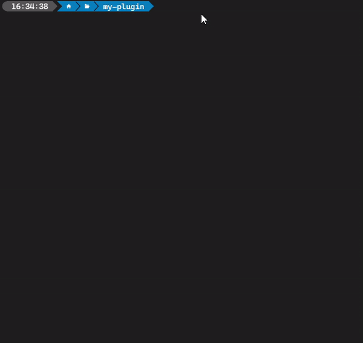

<div align="center">

[](https://docs.elgato.com/sdk)

# Stream Deck SDK (Beta)

[](https://www.npmjs.com/package/@elgato/streamdeck)
[](https://docs.elgato.com/sdk)
[](https://discord.gg/GehBUcu627)
[![Elgato homepage](https://img.shields.io/badge/Elgato-3431cf?labelColor=grey&logo=data:image/svg+xml;base64,PHN2ZyByb2xlPSJpbWciIHZpZXdCb3g9IjAgMCAyNCAyNCIgeG1sbnM9Imh0dHA6Ly93d3cudzMub3JnLzIwMDAvc3ZnIj48dGl0bGU+RWxnYXRvPC90aXRsZT48cGF0aCBmaWxsPSIjZmZmZmZmIiBkPSJtMTMuODgxOCA4LjM5NjQuMDI2MS4wMTk2IDkuOTQ5NCA1LjcxNzJjLS40ODg0IDIuNzI5LTEuOTE5NiA1LjIyMjMtNC4wMzg0IDcuMDI1M0ExMS45MjYyIDExLjkyNjIgMCAwIDEgMTIuMDk3IDI0Yy0zLjE5MjUgMC02LjE5MzktMS4yNDc3LTguNDUyNy0zLjUxNDRDMS4zODY4IDE4LjIxODguMTQyNyAxNS4yMDQ0LjE0MjcgMTJjMC0zLjIwNDIgMS4yNDQtNi4yMTg3IDMuNTAxNS04LjQ4NTRDNS45MDE5IDEuMjQ4IDguOTAzMiAwIDEyLjA5NyAwYzIuNDM5NCAwIDQuNzg0Ny43MzMzIDYuNzgzIDIuMTE4NyAxLjk1MjYgMS4zNTQgMy40NDY2IDMuMjM1NyA0LjMyMjcgNS40NDIyLjExMTIuMjgyOS4yMTQ5LjU3MzYuMzA1MS44NjU3bC0yLjEyNTUgMS4yMzU5YTkuNDkyNCA5LjQ5MjQgMCAwIDAtLjI2MTktLjg2OTRjLTEuMzU0LTMuODMwMy00Ljk4MTMtNi40MDQ4LTkuMDIzNy02LjQwNDhDNi44MTcxIDIuMzg4MyAyLjUyMiA2LjcwMDUgMi41MjIgMTJjMCA1LjI5OTUgNC4yOTUgOS42MTE1IDkuNTc0OCA5LjYxMTUgMi4wNTIgMCA0LjAwODQtLjY0NDIgNS42NTk2LTEuODY0NyAxLjYxNzItMS4xOTU1IDIuODAzNi0yLjgzMzcgMy40MzA5LTQuNzM2NGwuMDA2NS0uMDQxOUw5LjU5MDYgOC4zMDQ4djcuMjI1Nmw0LjAwMDQtMi4zMTM4IDIuMDYgMS4xODExLTUuOTk2MiAzLjQ2ODgtMi4xMi0xLjIxMjZWNy4xOTQzbDIuMTE3NC0xLjIyNDUgNC4yMzA5IDIuNDI3OS0uMDAxMy0uMDAxMyIvPjwvc3ZnPg==)](https://elgato.com)

</div>

## 👋 You're Early!

Welcome to the Stream Deck SDK for Node.js. Designed to make creating Stream Deck plugins easy, the Stream Deck SDK provides everything you need to connect, communicate and build with Stream Deck, and lets you focus on the fun stuff.

The Stream Deck SDK for Node.js is currently in public beta, and is available to everyone running Stream Deck 6.4 or newer. If you're interested in building plugins and would like to know more, please join our [Marketplace Makers Discord](https://discord.gg/GehBUcu627).

> Creating Stream Deck plugins with Node.js requires Node.js v20.5.1. When installing Node.js, we recommended using a version manager such as [nvm](https://github.com/creationix/nvm) (macOS) or [nvm-windows](https://github.com/coreybutler/nvm-windows) (Windows).

## 🚀 Quick Start

We recommend using the [`@elgato/cli`](https://github.com/elgatosf/cli) tool for building Stream Deck plugins as this provides all scaffolding required to get started with a sample "Counter" plugin.

Install the CLI.

```bash
npm install -g @elgato/cli
```

Once installed, run the `create` command to initialize the creation wizard.

```bash
streamdeck create
```

<p align="center">
  
</p>

## 🗺️ Plugin Structure

After creating a plugin with `streamdeck create` you'll be provided with a local environment for building a plugin.

```
/
├── *.sdPlugin/
│   ├── bin/
│   ├── imgs/
│   ├── logs/
│   └── manifest.json
├── src/
│   ├── actions/
│   │   └── increment-counter.ts
│   └── plugin.ts
├── package.json
├── rollup.config.mjs
└── tsconfig.json
```

### \*.sdPlugin/

The root of the plugin; this folder contains the build output from the source files as well as assets that support the plugin, such as icons, profiles, etc.

-   **manifest.json** - plugin metadata (for more information, see [manifest documentation](https://docs.elgato.com/sdk/plugins/manifest)).
-   **bin/** - build output.
-   **imgs/** - assets used by the plugin, such as icons, profiles, etc.
-   **logs/** - logs generated from [`streamDeck.logger`](#-logging).

### src/

-   **plugin.ts** - build entry point.
-   **actions/increment-counter.ts** - example "Counter" action.

The `package.json` provides two scripts for building the plugin.

-   `npm run build` - builds the plugin.
-   `npm run watch` - continuously watches for changes, and hot-reloads the plugin after build.

## ✨ Actions

Actions are the star of the show and enable users to interact with plugins. At their core, actions are classes that fulfil an interface. This enables the SDK to route events, such as key down, dial rotate, etc., emitted from Stream Deck to the appropriate action, as determined by the action's unique-identifier.

The following is an example of an action that listens for the `keyDown` event, and then sets the title of the action to "Hello world" after being pressed.

> **src/actions/say-hello.ts**
>
> ```typescript Hello world
> import { action, KeyDownEvent, SingletonAction } from "@elgato/streamdeck";
>
> @action({ UUID: "com.elgato.hello-world.say-hello" })
> export class SayHelloAction extends SingletonAction {
>     /**
>      * Listen for the key down event that occurs when a user presses
>      * a Stream Deck button, and change the title of the action.
>      */
>     async onKeyDown(ev: KeyDownEvent) {
>         await ev.action.setTitle("Hello world");
>     }
> }
> ```

The action's implementation must be registered in the sources' entry point`.

> **src/plugin.ts**
>
> ```typescript
> import streamDeck from "@elgato/streamdeck";
>
> import { SayHelloAction } from "./actions/say-hello";
>
> // Register the action, and connect to Stream Deck.
> streamDeck.actions.registerAction(new SayHelloAction());
> streamDeck.connect();
> ```

And the action's metadata must be defined within the plugin's manifest file.

> **\*.sdPlugin/manifest.json**
>
> ```jsonc
> {
>     // Learn more: https://docs.elgato.com/sdk/plugins/manifest
>     "Actions": [
>         {
>             "Name": "Say Hello",
>             "UUID": "com.elgato.hello-world.say-hello", // Note, this matches the UUID in the action class.
>             "States": [{ "TitleAlignment": "middle" }]
>         }
>     ]
> }
> ```

When observing changes with `npm run watch`, the changes will immediately be available within Stream Deck. Altneratively the changes can be built with `npm run build` followed by `streamdeck restart <uuid>`, where `<uuid>` represents the unique-identifier of your plugin.

## 🎛️ Devices

The `streamDeck.devices` collection contains information about known devices associated with the user. This includes information such as the id, name, and type of device. Additionally, as devices may not be connected at all times the `Device` provides insight into the connection status of a device.

```typescript
import streamDeck from "@elgato/streamdeck";

streamDeck.devices.forEach((device) => {
    // Device information including id, name, type, etc.
});
```

## 🐞 Debugging

Plugins can be debugged from all supporting Node.js debuggers, such as Visual Studio Code, Chrome, etc., and by default will have debugging enabled when created with the CLI tool's `streamdeck create` command.

Debugging can be configured from within the plugin's manifest as part the Node.js configuration object.

```jsonc
{
    // ...
    "Nodejs": {
        "Version": "20",
        "Debug": "enabled"
    }
}
```

There are four available options when configuring the `Debug` property within the manifest:

-   `"enabled"` - the plugin will run with [`--inspect`](https://nodejs.org/api/cli.html#--inspecthostport) allowing debuggers to connect.
-   `"break"` - the plugin will launch with [`--inspect-brk`](https://nodejs.org/api/cli.html#--inspect-brkhostport) and will await a debugger attaching before running.
-   `string` - a collection of [CLI arguments](https://nodejs.org/api/cli.html) supplied to the plugin.
-   `undefined` - debugging is disabled.

> When running the plugin in either debug mode `"enabled"` or `"break"`, a random available port will be allocated to the debug listener each time the plugin launches. If you wish to listen on a specific port, the `Debug` value can be set to a string of CLI arguments, for example to listen on port `12345`, the `Debug` value would be `--inspect=127.0.0.1:12345`.

## 📄 Logging

The `streamDeck.logger` provides local file-based logging, allowing you to diagnose, track, and debug your plugin. Logs files operate a file-rotation policy and are re-indexed when the plugin starts or the log file exceeds 50MiB, with the 10 most recent log files being retained.

```typescript
import streamDeck, { LogLevel } from "@elgato/streamdeck";

const logger = streamDeck.logger.createScope("Custom Scope");

logger.error("Error message");
logger.warn("Warning message");
logger.info("Information message");
logger.debug("Debug message"); // ❌ Default level is INFO
logger.trace("Trace message"); // ❌ Default level is INFO

logger.setLevel(LogLevel.TRACE);

logger.debug("Debug message"); // ✅
logger.trace("Trace message"); // ✅
```

> When the log-level is set to `TRACE` **all** communication between the Stream Deck and the plugin will be logged to the file system, this includes all settings. Please ensure sensitive information is not transmitted whilst `TRACE` is active.
