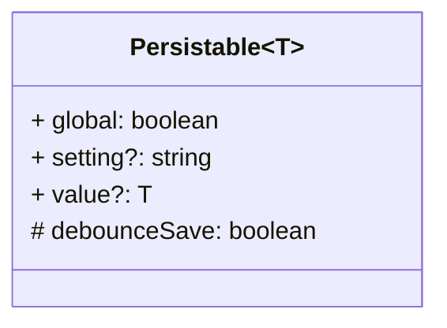
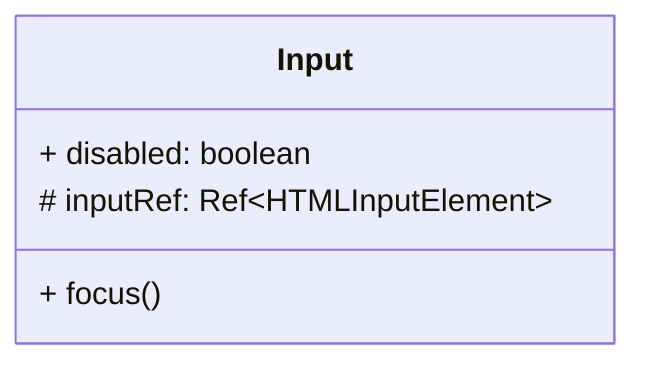
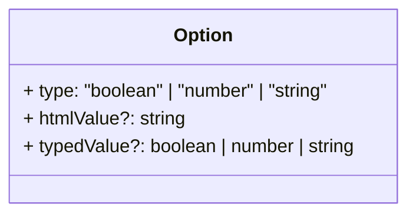

# Mixins

## Persistable&lt;T&gt;

Mixin that provides persisting a value to Stream Deck settings (action / global).

## Input

Mixin that provides common functionality for input elements.

## Option

Mixin that provides information for a selectable option.

